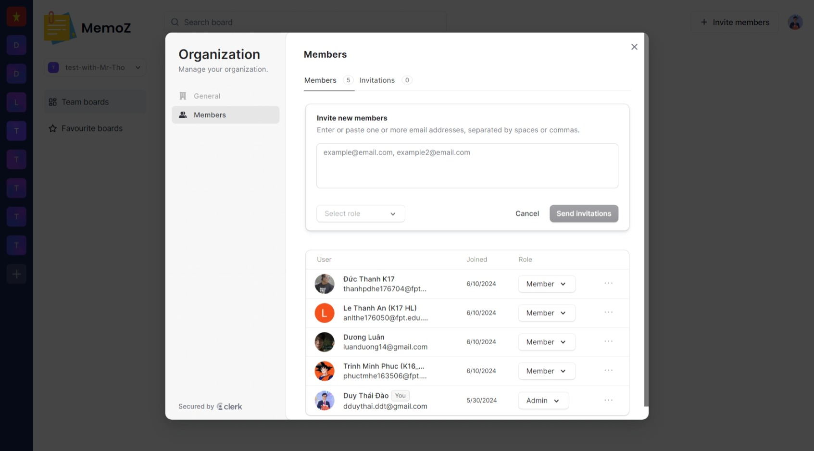

# MemoZ

MemoZ is a collaborative, real-time whiteboard built using NextJS and real-time database. This repository contains the source code and necessary files to run the MemoZ application.

## Screenshots




## Features

- **Real-time Collaboration:** Allows multiple users to collaborate on the same whiteboard in real-time. Changes made by one user are instantly visible to all other users.
- **Interactive Drawing Tools:** Provides a variety of tools such as pen, eraser, shapes, and text to create and annotate drawings. Users can choose different colors and stroke widths.
- **Undo/Redo Functionality:** Includes undo and redo buttons to easily correct mistakes or revert changes, enhancing the user experience.
- **User Authentication:** Secure login system using Firebase Authentication to manage users. Only authenticated users can create or join a whiteboard session.
- **Responsive Design:** The application is optimized for both desktop and mobile devices, ensuring a seamless experience across different screen sizes.
- **Session Management:** Users can create new whiteboard sessions or join existing ones using a unique session ID.
- **Chat Feature:** Integrated chat functionality for users to communicate in real-time while collaborating on the whiteboard.

## Installation

To run MemoZ locally, please ensure that you have the following prerequisites installed on your system:

- Node.js (version 14.x or later)
- npm (version 6.x or later) or yarn (version 1.x or later)

Follow the steps below to set up the project:

1. **Clone the repository:**

    ```bash
    git clone https://github.com/DaoDuyThai/MemoZ
    ```

2. **Navigate to the project directory:**

    ```bash
    npm install
    ```

3. **Create a .env.local file for environment variables:**

    ```bash
    touch .env.local
    ```
    This .env.local file includes:
    ```bash
    CONVEX_DEPLOYMENT=your_convex_deployment
    NEXT_PUBLIC_CONVEX_URL=your_convex_url
    NEXT_PUBLIC_CLERK_PUBLISHABLE_KEY=your_clerk_publishable_key
    CLERK_SECRET_KEY=your_clerk_secret_key
    LIVEBLOCKS_SECRET_KEY=your_liveblocks_secret_key
    NEXT_PUBLIC_APP_URL=your_app_url
    STRIPE_API_KEY=your_stripe_api_key
    STRIPE_WEBHOOK_SECRET=your_stripe_webhook_secret
    ```

4. **Run the development server:**

    ```bash
    npm run dev
    ```
    and
    ```bash
    npx convex dev
    ```
    
## Contributing

Contributions to MemoZ are always welcome. If you would like to contribute, please follow these steps:

1. **Fork the repository.**
2. **Create a new branch:**

    ```bash
    git checkout -b my-new-feature
    ```

3. **Make your changes and commit them:**

    ```bash
    git commit -m "Add some feature"
    ```

4. **Push to the branch:**

    ```bash
    git push origin my-new-feature
    ```

5. **Open a pull request and provide a detailed description of your changes.**

Please make sure to adhere to the code style and conventions used in the project.

## Acknowledgements

MemoZ makes use of the following open-source libraries and APIs:

- Next.js
- React
- Tailwind CSS
- Shadcn
- Convex
- Clerk
- Liveblocks
- Stripe

Special thanks to the developers and contributors of these projects for their valuable work.


## License

The MemoZ is licensed under the [MIT License.](https://choosealicense.com/licenses/mit/)

## Contact

If you have any questions, suggestions, or feedback, please feel free to contact the project maintainer at:

[](https://portfolio.codewithdt.com/)
[](https://www.linkedin.com/in/dduythai/)
[](https://www.youtube.com/@codewithdt)
[](https://www.facebook.com/duythai.ddt/)
[](https://www.instagram.com/dduy_thai/)
[](https://twitter.com/codewithdt)
